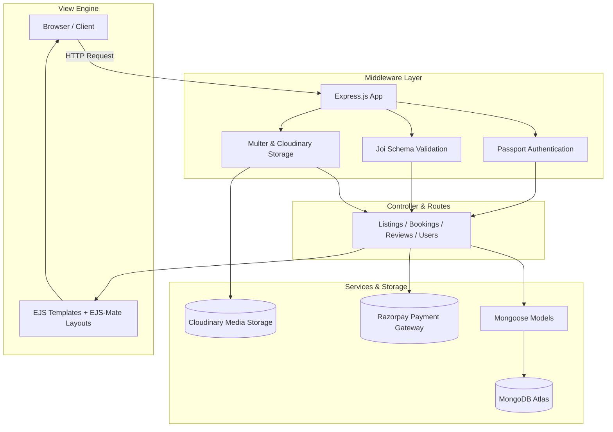

> A full-stack vacation rental platform for discovering, listing, and booking unique stays worldwide. Built with Node.js, Express, MongoDB, EJS, Leaflet maps, and Razorpay payment integration.

🌐 **Live Demo:** [https://property-rental-platform-kthp.onrender.com](https://property-rental-platform-kthp.onrender.com)

---

## Key Features

- **Multi-Unit Inventory & Booking Engine**: Multi-instance property tracking (`totalUnits`) with date overlap validation ensuring sold-out dates are automatically blocked.
- **Role-Based Access & Review Control**: Session authentication via Passport.js with owner-only listing management and post-checkout review verification.
- **Razorpay Payment Gateway Integration**: Seamless checkout flow with server-side order generation (`razorpay.orders.create`) and cryptographic HMAC SHA256 signature verification.
- **Geocoding & Interactive Pin-Placement**: Leaflet.js and OpenStreetMap with Nominatim geocoding and draggable map markers storing GeoJSON coordinates (`[lng, lat]`).
- **Multi-Photo Upload**: Cloudinary media integration supporting up to 10 photos per listing with client-side `DataTransfer` file synchronization and HTML5 drag-and-drop reordering.
- **Dynamic Category & Location Filtering**: Multi-field search and category filtering across titles, descriptions, cities, and countries.

---

## Application Architecture

StayHere follows an **MVC (Model-View-Controller)** architectural pattern built on Express.js:



---

## Technology Stack

| Component | Technology |
|---|---|
| **Backend Runtime** | Node.js (v20.x / v24.x) |
| **Web Framework** | Express.js |
| **Database** | MongoDB / MongoDB Atlas (Mongoose ODM) |
| **Payments** | Razorpay SDK & Razorpay Checkout JS |
| **Authentication** | Passport.js & Passport-Local |
| **Session & Cache** | Express-Session, Connect-Mongo |
| **Templating Engine** | EJS & EJS-Mate Layouts |
| **Styling & UI** | Vanilla CSS, Bootstrap 5, FontAwesome 6 |
| **Mapping & Geocoding** | Leaflet.js, OpenStreetMap, Nominatim API |
| **File Storage** | Multer, Cloudinary v2 |
| **Schema Validation** | Joi |

---

## Local Development Setup

### Prerequisites
- Node.js installed on your machine
- MongoDB Atlas connection URI (or local MongoDB)
- Cloudinary account credentials
- Razorpay account credentials (Test or Live API Keys)

### Installation Steps

1. **Clone the repository**:
   ```bash
   git clone https://github.com/mdjamal001/Property-Rental-Platform.git
   cd Property-Rental-Platform
   ```

2. **Install dependencies**:
   ```bash
   npm install
   ```

3. **Configure Environment Variables**:
   Create a `.env` file in the root directory:
   ```env
   MONGO_ATLAS_URL=mongodb+srv://<username>:<password>@cluster0.xxx.mongodb.net/?retryWrites=true&w=majority
   CLOUD_NAME=your_cloudinary_cloud_name
   CLOUD_API_KEY=your_cloudinary_api_key
   CLOUD_API_SECRET=your_cloudinary_api_secret
   SECRET=your_session_secret_key
   RAZORPAY_KEY_ID=your_razorpay_key_id
   RAZORPAY_KEY_SECRET=your_razorpay_key_secret
   ```

4. **Seed the Database**:
   Populate your database with sample listings, GeoJSON coordinates, and photo galleries:
   ```bash
   node init/db_init.js
   ```

5. **Start the Development Server**:
   ```bash
   nodemon index.js
   ```
   Open your browser at `http://localhost:8080/`.

---

## License
This project is open source and available under the [ISC License](LICENSE).
